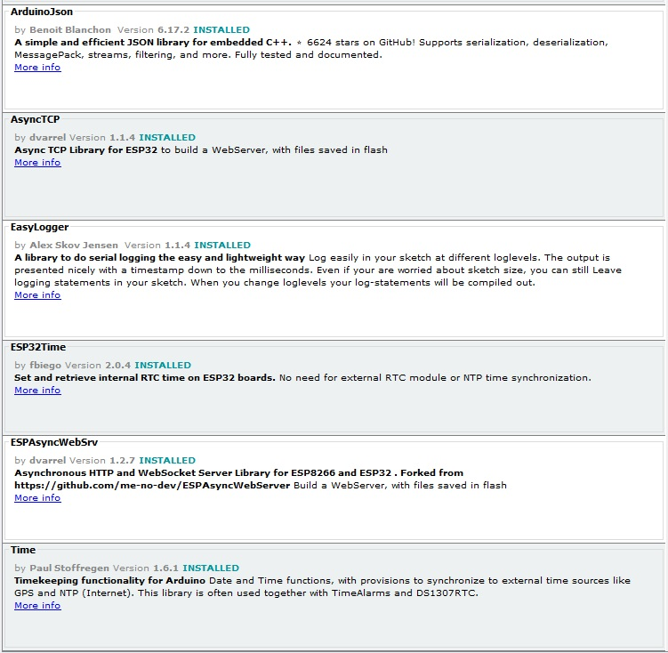

# Building and installing CheapoDC

## Set Up Your Build Environment


1. Install the Arduino IDE.  
  <u>**NOTE:**</u> Builds have been verified on both the 2.3.2 and 1.8.19 versions of the Arduino IDE.
2. Add support for ESP32 modules using the Boards Manager in the Arduino IDE.  
  <u>**NOTES:**</u> 
    * Install the boards plugin from Espressif Systems version 2.0.x. Version 3.0.0 or greater is **NOT** supported.
    * CheapoDC is intended for use on ESP32 devices. The current version has been verified on an ESP32-C3 Supermini board.
3. Install the ESP32 Sketch data uploader with support for LittleFS. The CheapoDC uses the LittleFS file system for configuration files and web pages uploaded from the ***CheapoDC/data*** folder. If the data is uploaded using any other file system format, such as SPIFFS, the CheapoDC firmware will not run properly.  
<u>**NOTE:**</u> The following links provide information on how to install a data uploader plugin with LittleFS support for:
    * Arduino IDE 1.8.x: https://randomnerdtutorials.com/esp32-littlefs-arduino-ide/
    * Arduino IDE 2.3.2: https://randomnerdtutorials.com/arduino-ide-2-install-esp32-littlefs/

4. Install the following libraries if not already installed:  

    

   <u>**NOTES:**</u>  
   * ArduinoJson **MUST** be a 6.x.x version. Version 7 was released after the release of this firmware and contains some non-backwards compatible changes to memory management that impact this version of the CheapoDC firmware.
   * If newer versions of a library are available then only use new subversions not new major versions.

5. Download the latest firmware release from <https://github.com/hcomet/CheapoDC/releases>  
  <u>**NOTE:**</u> After extracting the release to your file system open the CheapDC.ino file in the Arduino IDE. This will open the full set of source files in the IDE. Now configure the firmware before building it.
## Configure Firmware in the CDCdefines.h file
Edit the ***CDCdefines.h*** file to configure/customize the firmware before building:
  1. Set the ESP32 pins to be used for PWM output. ***DEFAULT: 0 & 1***.  
     ```#define CDC_PWM_OUPUT_PIN1 0```   
     ```#define CDC_PWM_OUPUT_PIN2 1 ```
  2. Set the PWM channel to use. ***DEFAULT: 0***.  
     ```#define CDC_PWM_CHANNEL 0```
  3. Set the pin for the status LED on you ESP32. ***DEFAULT: 8***.  
     ```#define CDC_STATUS_LED 8```
  4. Enable/Disable Basic Web Authentication. ***DEFAULT: Enabled***.  
     ```#define CDC_ENABLE_WEB_AUTH```  
     <u>**NOTE:**</u> Comment out the ```#define``` to disable.
  5. Change the Web Authentication ID and Password. ***DEFAULT: Admin, Admin***.  
      ```#define CDC_DEFAULT_WEB_ID "admin"```  
      ```#define CDC_DEFAULT_WEB_PASSWORD "admin"```  
      <u>**NOTE:**</u> Web Authentication is the only security for OTA firmware updates. 
  6. Enable/Disable Web Socket API support. ***DEFAULT: Disabled***.  
     ```// #define CDC_ENABLE_WEB_SOCKETS```  
    <u>**NOTE:**</u> Uncomment the ```#define``` to enable. Web Socket API support is not needed to use the CheapoDC or the associated INDILIB driver. If the Web Socket API support is enabled then **two** changes are required to increase both the Web Sockets message queue and the AsyncTCP async queue or refreshing the 
    Web UI config page will cause random crashes due to AsyncTCP locking up on a full queue.  
      1. In the AsyncTCP.cpp file in your Arduino Libraries folder:  
    Change  
    ```_async_queue = xQueueCreate(32, sizeof(lwip_event_packet_t *));```  
    to  
    ```_async_queue = xQueueCreate(64, sizeof(lwip_event_packet_t *));```  

      2. In the AsyncWebSocket.h file in your Arduino Libraries folder,  
    Change  
    ```#define WS_MAX_QUEUED_MESSAGES 32```  
    to  
    ```#define WS_MAX_QUEUED_MESSAGES 64```  

  7. Set up the WiFi configuration.  The CheapoDC may operate in either Access Point (AP) mode or Station (ST) mode. The CheapoDC defaults to AP mode when it cannot connect to an access point.
     * AP Mode settings must be configured in the ***CDCdefines.h*** file:
       * Change AP mode SSID. ***DEFAULT: cheapodc***.  
         ```#define CDC_DEFAULT_WIFI_AP_SSID "cheapodc"```  
       * Change AP mode password. ***DEFAULT: cheapodc***.  
         ```#define CDC_DEFAULT_WIFI_AP_PASSWORD "cheapodc"```  
     * ST Mode settings may be configured in either the ***CDCdefines.h*** file or the ***CDCWiFi.json*** file found in the ***data*** folder. Values in found in the ***CDCWiFi.json*** files will be used before using the values in the ***CDCdefines.h*** file. Using the ***CDCWiFi.json*** file to configure WiFi access allows multiple APs and credentials to be defined. How to configure the ***CDCWiFi.json*** file is found [here](#CDCWiFijson) while configuring default values in the ***CDCdefines.h*** file is as follows:
       * Change ST mode SSID. ***DEFAULT: defaultSSID***.  
         ```#define CDC_DEFAULT_WIFI_SSID "defaultSSID"```  
       * Change ST mode password. ***DEFAULT: defaultPassword***.  
         ```#define CDC_DEFAULT_WIFI_PASSWORD "defaultPassword"``` 

  8. The hostname for the CheapoDC may also be changed. This is really only needed if you have multiple CheapoDC controllers on the same network.  Its recommended that this be done in the ***CDCWiFi.json*** file to allow a single firmware image to be used across multiple CheapoDC controllers. To change the hostname in the ***CDCdefines.h*** file:
     * Change the host name. ***DEFAULT: cheapodc***.  
       ```#define CDC_DEFAULT_HOSTNAME "cheapodc"```
  9. Set which weather service API to use for weather queries. ***DEFAULT: OpenWeather***.  
    ```#define CDC_USE_OPEN_WEATHER```  
    <u>**NOTE:**</u> Comment out the ```#define``` to enable Open-Meteo.
     * if you use [OpenWeather](https://openweathermap.org/) then you will need to register at OpenWeather for a free account and API key. Register [here](https://home.openweathermap.org/users/sign_up). The API key may be set set up by using the Web API or in the ***CDCdefines.h*** file:
       * Set the OpenWeather API key. ***DEFAULT: "blank"***.  
         ```#define CDC_DEFAULT_WEATHERAPIKEY ""```
     * if you use [Open-Meteo](https://open-meteo.com/) then no registration is required and no API key is needed.  
       
      <u>**NOTES:**</u>
      * **DO NOT** modify the URLs for API or Icon calls.
      * The Weather Service provider can only be set in the ***CDCdefines.h*** file. If you switch the service provider then the ***CDCConfig.json*** file on the controller needs to be deleted and the controller restarted to properly switch to the new service provider.
## Build and Run
1. After configuring values in the CDCdefines.h, build and upload the firmware to your ESP32-C3.
2. Upload the files in the CheapoDC/data folder using the Sketch data uploading tool. 
    * **LittleFS file system formatting MUST be used for the data upload.**
    * these files are needed for the Web UI as well as configuration of the CheapoDC.
    * Modify the CDCWiFi.json file ([see below](#CDCWiFijson)) to configure CheapoDC to access your wireless network.
    * No changes are required to the CDCConfig.json. Adding your OpenWeather API Key may be done through the [Web UI](../README.md/#web-ui).

# Configuration Files

## CDCWiFi.json

This file provides a list of WiFi access points that will be tried by the CheapoDC to establish a network connection. This file must be edited on your PC and uploaded using the Sketch data upload tool.

The file content is json formatted using "name":"value" pairs.

`{"hostname":"cheapodc","connectAttempts":"10","tryAPs":"1","wifi":[{"ssid":"FakeSSID1","password":"Password1"},{"ssid":"FakeSSID2","password":"Password2"}]}`

The example shows settings for two access points in the "wifi" section. This can be 1 or several access points. The CheapoDC, in station mode (STA), will step through the list sequentially until a successful WiFi connection is achieved. 
1. Replace "FakeSSID1" and "Password1" for the first AP to try with your first SSID and password.  
```{"ssid":"FakeSSID1","password":"Password1"}```
2. To set up a second AP (or more) then update "FakeSSID2" and "Password2" for the second AP (or add more entries separated by commas for more APs). If you only want one AP then delete the entry including the preceding comma.  
```{"ssid":"FakeSSID2","password":"Password2"}```
2. You can also change the "hostname" from the default of ***cheapodc***.  
```"hostname":"cheapodc"```
3. Changing "connectAttempts" will change then number of times the CheapoDC will attempt to connect to an access point before moving to the next access point in the list.  
```"connectAttempts":"10"```
4. Changing "tryAPs" will change the number of times the CheapoDC will loop through the list of access points before switching to Access Point (AP) mode.  
```"tryAPs":"1"```

If the CheapoDC fails to connect to an access point in Station Mode then it will switch to Access Point mode. The SSID and Password for AP mode is set in the [***CDCdefines.h***](#configure-firmware-in-the-cdcdefinesh-file) file.

If no ***CDCWiFi.json*** file is found then the values for WiFi configuration will be taken from the [***CDCdefines.h***](#configure-firmware-in-the-cdcdefinesh-file) file. 

## CDCConfig.json

This file is used to save the dew controller configuration between power cycles. If the file is not present then the values defined in the ***CDCdefines.h*** file (the firmware defaults) will be used. The CheapoDC checks for changes to the configuration every 10 seconds and if a change is detected then the full ***CDCdefines.h*** file will be written to the LittleFS file system on the controller. 

Controller configuration may be modified via the [Web UI](../README.md/#web-ui) or the [CheapoDC API](../README.md/#cheapodc-api). The [CheapoDC commands](../README.md/#cheapodc-commands) which support a ***Setter*** function also represent the values stored in the ***CDCdefines.h***.

    