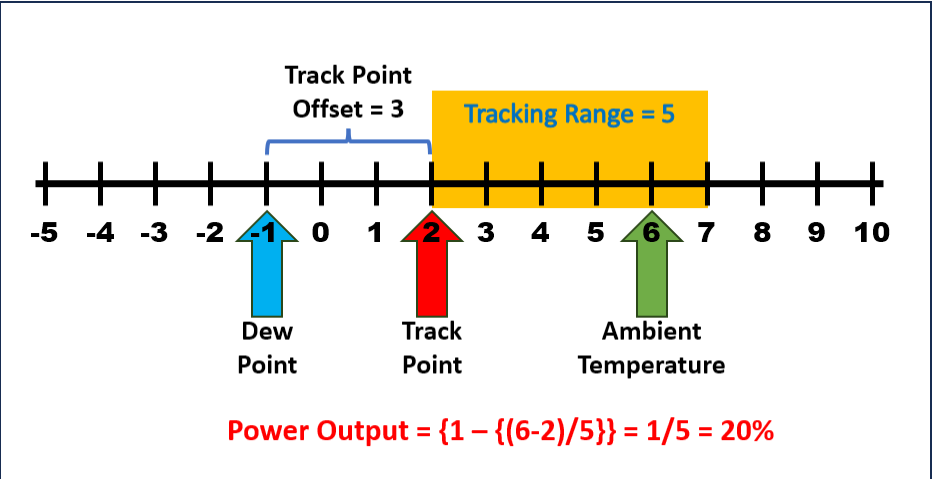
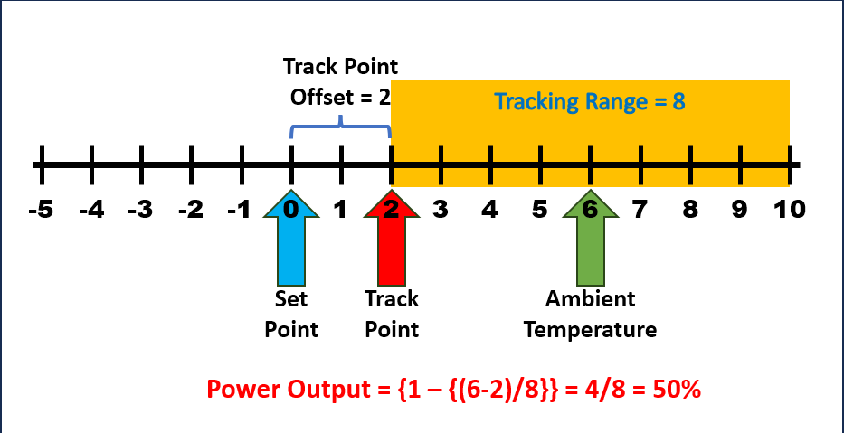

The Cheapo Dew Controller, or CheapoDC, is a low cost, easy to build DIY dew controller based on an ESP32-C3 mini. Parts required include the ESP32-C3 mini, one or two MOSFET modules, 12V to 5V buck converter, some proto board, a couple of RCA sockets, a 12V barrel socket and wire. Cost of the parts should be less than $20 for a unit that controls 2 dew strap heaters.

A primary goal was to keep the build simple with minimal parts. This is done by leveraging the ESP32 WiFi capability to query the OpenWeather API for ambient temperature and dew point. This is then used for calculating CheapoDC's power output. No additional components to support temperature or humidity probes. The responsiveness or aggressiveness of the controller can be adjusted through several settings. CheapoDC works best with Internet connectivity supporting the weather queries to OpenWeather but it can also be used in a limited way without Internet access. 

# How the Controller Works

The following modes of operation are used in the algorithm that calculates controller output. The first item under each 
mode is the default.

## Controller Modes
* ### Automatic  
  * Uses the **Set Point Mode** and **Temperature Mode** settings to calculate the controller output based on the algorithm below.
* ### Manual
  * Controller output is manually controlled by setting the **Dew Controller Output** either through the Web UI or the API.
* ### Off
  * Controller output is set to Zero.

## Set Point Modes:
* ### Dew Point
  * Uses the **Dew Point** as the Set Point used for calculating output.
* ### Temperature
  * Uses a **Temperature Set Point** value input via the Web UI or API as the Set Point for calculating output.
* ### Midpoint
  * Use the midpoint between the current **Temperature Mode** temperature value and the Dew Point value as the Set Point for calculating output.

## Temperature Modes:
* ### Weather Query
  * Use the Ambient Temperature returned by the OpenWeather weather query as the reference temperature for calculating the controller output.
* ### External Input
  * Use the **External Input** temperature set through the Web UI or API as the reference temperature for calculating the controller output. This may be the preferred mode when using the controller with KStars/Indi. The CheapoDC Indilib driver can use a temperature probe attached to a focuser as the external input. 

## Controller Power Output Model
### Variables:
* **Set Point** = ***SP***
  - as set using the **Set Point** selection.
* **Reference Temperature** = ***RT***
  - as set using the **Temperature Mode** selection.
* **Track Point** = ***TP***
  - the temperature point where the **Tracking Range** starts. A **Reference Temperature** less than or equal 
to the **Track Point** will cause the controller to use **Maximum Output**. 
* **Track Point Offset** = ***TPO***
  - an offset applied to the **Set Point** when determining the **Track Point** relative to the **Set Point**. 
The **Track Point Offset** may be set from -5.0 to 5.0 degrees Celsius. The default is 0.0 degrees Celsius.
* **Tracking Range** = ***TR***
  - the temperature range starting at the **Track Point** where the controller output ramps up from **Minimum Output** at the high end of the range to **Maximum Output** at the low end of the range. The range may be set to values from 
4.0 to 10.0 degrees Celsius. The default is 4.0 degrees celsius.
* **Power Output** = ***PO***
  - the percentage of power the controller is outputting to the dew straps. It varies from the **Minimum Output** setting to the **Maximum Output** setting.
* **Minimum Output** = ***MinO***
  - the minimum percent power setting for the controller to output when not in the **Off** **Controller Mode**. Defaults to 0%.
* **Maximum Output** = ***MaxO***
  - the maximum percent power setting for the controller to output when at full output. Defaults to 100%.

### Calculations
$`TP = SP + TPO`$

$`IF`$ $`(RT <= TP )`$ $`THEN`$ $`PO= MaxO`$

$`IF`$ $`(( RT - TP ) >= TR)`$ $`THEN`$ $`PO = MinO`$

$`IF`$ $`(( RT - TP) < TR)`$ $`THEN`$ $`PO = MinO + (MaxO - MinO) * ( 1 - (RT - TP)/(TR))`$

### Examples

1. Reference image to illustrate the definitions above.
   * SP = -1, TPO = 3 creating a TP = 2
   * TPR = 5, but RT = 8 which is greater than TP + TPR = 7
   * PO is set to MinO, which is 0%
 

3. Example 2

4. Example 3

        
        

        

