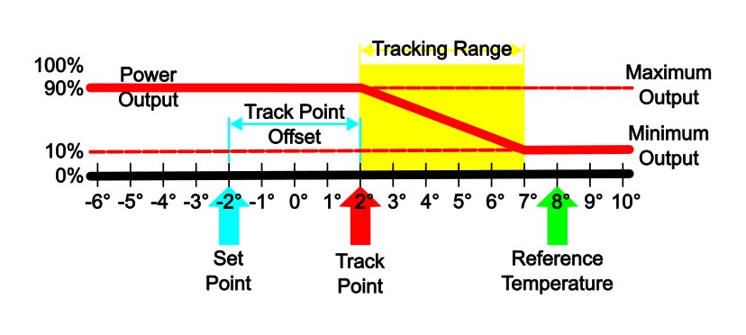
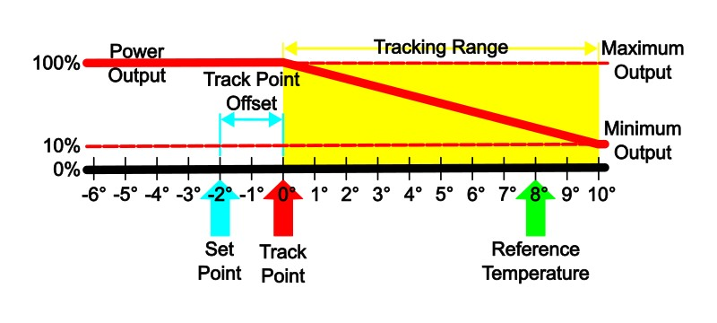
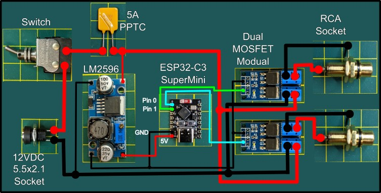
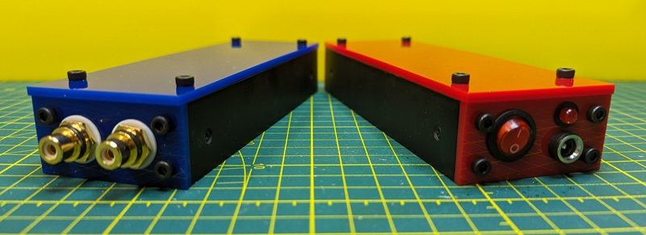
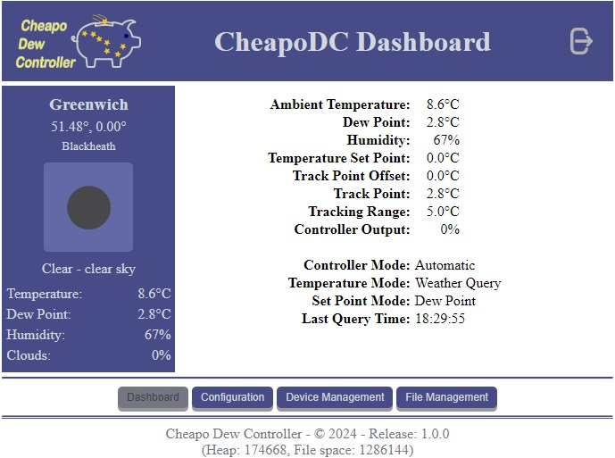
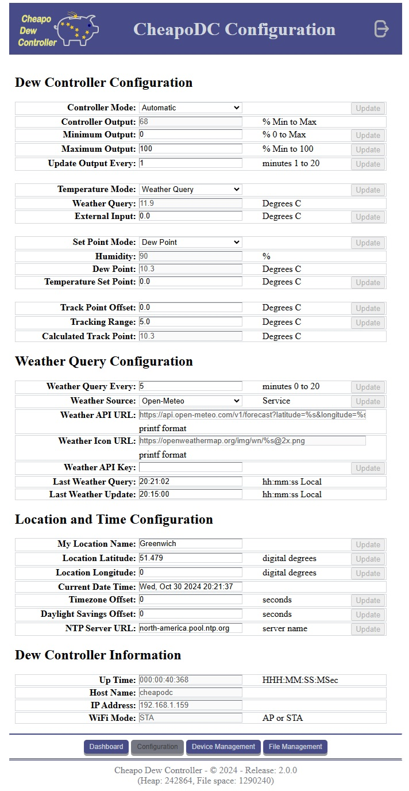
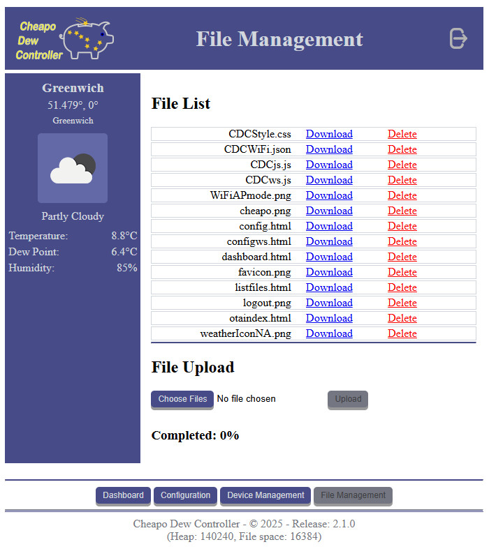

The Cheapo Dew Controller, or CheapoDC, is a low cost, easy to build DIY dew controller based on an ESP32-C3 mini. Parts required include the ESP32-C3 mini, one or two MOSFET modules, a 12V to 5V buck converter, some protoboard, a couple of RCA sockets, a 12V barrel socket and wire. Cost of the parts should be less than $20 for a unit that controls 2 dew heater straps. Details on how to build the CheapoDC firmware may be found with the source code in the [CheapoDC/README.md](CheapoDC/README.md) and hardware details can be found in the [Hardware](/README.md#hardware) section of this document.

A primary goal was to keep the build simple with minimal components. This is done by leveraging the ESP32 WiFi capability to query one of the open weather service APIs. Either the [OpenWeather](https://openweathermap.org/) API or the [Open-Meteo](https://open-meteo.com/) API may be used to retrieve ambient temperature, humidity and dew point for the controller's geographic location. This is then used to calculate CheapoDC's power output. No additional components, such as temperature or humidity probes, are required. The responsiveness and aggressiveness of the controller can be adjusted through several configuration settings. CheapoDC works best with internet connectivity to support the weather service queries but it can also be used in a limited way without internet access. 

Although the CheapoDC supports two dew strap outputs, the output levels are not individually controlled. Two separate MOSFET modules are used but the PWM output for the two ESP32 pins driving the MOSFETs are tied to the same PWM channel.

# How the Controller Works
When working in Automated mode, the controller will periodically calculate the power output to the dew straps using the calculations below. The default output calculation or update period is 1 minute.
## Controller Power Output Calculation
### Variables:
* **Set Point** = ***SP***
  - as set using the **Set Point Mode** selection.
* **Reference Temperature** = ***RT***
  - as set using the **Temperature Mode** selection.
* **Track Point** = ***TP***
  - the calculated temperature point where the **Tracking Range** starts. A **Reference Temperature** less than or equal 
to the **Track Point** will cause the controller to use **Maximum Output**. 
* **Track Point Offset** = ***TPO***
  - a temperature offset applied to the **Set Point** when calculating the **Track Point** relative to the **Set Point**. 
The **Track Point Offset** may be set from -5.0&deg;C to 5.0&deg;C. The default is 0.0&deg;C.
* **Tracking Range** = ***TR***
  - the temperature range starting at the **Track Point** where the controller output ramps up from **Minimum Output** at the high end of the range to **Maximum Output** at the low end of the range. The range may be set to values from 
4.0&deg;C to 10.0&deg;C. The default is 4.0&deg;C.
* **Power Output** = ***PO***
  - the percentage of power the controller is outputting to the dew straps. It varies from the **Minimum Output** setting to the **Maximum Output** setting.
* **Minimum Output** = ***MinO***
  - the minimum percent power setting for the controller to output when not in the **Off** **Controller Mode**. Defaults to 0%.
* **Maximum Output** = ***MaxO***
  - the maximum percent power setting for the controller to output when at full output. Defaults to 100%.

### Calculations
$`TP = SP + TPO`$

$`IF`$ $`(RT <= TP )`$ $`THEN`$ $`PO= MaxO`$

$`IF`$ $`(RT >= (TP + TR))`$ $`THEN`$ $`PO = MinO`$

$`IF`$ $`(RT <(TP + TR))`$ $`THEN`$ $`PO = MinO + (MaxO - MinO) * ( 1 - ((RT - TP)/TR))`$

### Examples

Example 1 is primarily a reference image to illustrate the variables defined above.
   * Power Output curve is shown relative to the Track Point and the Tracking Range. While the Reference Temperature is greater than the high end of the Tracking Range the Power Output is set to Minimum Output. The Power Output ramps up linearly through the Tracking Range from the Minimum Output to the Maximum Output as the Reference Temperature drops.
   * This example shows a Reference Temperature, RT = 8°C, which is greater than the upper end of the Tracking Range, causing Power Output to be set to Minimum Output. In this case Minimum Output is set to 10%.
   * The upper end of the Tracking Range, at 7°C, is determined from the Set Point (SP = -2°C) plus the Track Point Offset (TPO = 4°C), creating a Tack Point, TP = 2°C, plus the Tracking Range (TR = 5°C).  

   **NOTE:** The Set Point and the Reference Temperature values may vary from one output calculation to the next with 
	each weather update.
 

Example 2 shows changing the values of the controller configuration variables can affect the Power Output calculation.
   * The Set Point, SP = -2°C, and the Reference Temperature, RT = 8°C, the same as in Example 1. However changing the Track Point Offset, now TPO = 2°C, and the Tracking Range, now TR = 10°C, has changed the Power Output as well as flattening the Power Output curve.
   * The Maximum Output has been increased, MaxO = 100%, to allow full power output to be reached at 0&deg;C.

## Dew Controller Configuration Settings
The following modes of operation are used by CheapoDC to determine overall controller operation as well as which values to assign to the Set Point and Reference Temperature when calculating output.

### Controller Mode:
The Controller Mode selects the overall operating mode of the dew controller.
* #### Automatic  
  * Uses the **Set Point Mode** and **Temperature Mode** settings to calculate the controller output based on the Power Output calculations above. In Automatic mode the Power Output calculation will be run periodically based on the Update Output Every setting. This may be set to a value from 1 to 20 minutes. The default is 1 minute. Automatic mode may be used with or without internet access.
* #### Manual
  * Controller output is manually controlled by setting the **Dew Controller Output** either through the Web UI or the API. When in Manual mode the the periodic Power Output calculation is suspended. Using Manual control is an option if internet access for OpenWeather API queries is not available.
* #### Off
  * Controller output is set to Zero. 

### Set Point Mode:
The Set Point Mode selects what will be used as the SetPoint for calculating Power Output.
* #### Dew Point
  * Uses the **Dew Point** as the Set Point used for calculating output. This is the default selection.
* #### Temperature
  * Uses a **Temperature Set Point** value input via the Web UI or API as the Set Point for calculating output. If the CheapoDC is being used without internet access then this mode allows a Set Point to be defined when a the DeW Point cannot be determined through the OpenWeather API.
* #### Midpoint
  * Uses the midpoint between the current **Temperature Mode** temperature value and the Dew Point value as the Set Point for calculating output. The impact of selecting this mode is to effectively double the Tracking Range and further flatten the ramp of the Power Output curve.

### Temperature Mode:
The Temperature Mode selects how the Reference Temperature will be determined for calculating the Power Output.
* #### Weather Query
  * Uses the Ambient Temperature returned by the OpenWeather API weather query as the Reference Temperature for calculating the controller output. This requires that the CheapoDC have internet access.
* #### External Input
  * Use the **External Input** temperature set through the Web UI or API as the reference temperature for calculating the controller output. This may be the preferred mode when using the controller with KStars/Indi. The CheapoDC Indilib driver can use a temperature probe attached to a focuser as the external input. This is also the mode that should be used when the CheapoDC does not have access to the internat and the OpenWeather API.

# Hardware
One of the goals with the CheapoDC is to for it to be relatively easy to assemble. Although some soldering will be required the number of connections is minimized by using common modules.

Component list:
* ESP32-C3 SuperMini (Other ESP32 modules should work but this one is very small and low priced) Example: [https://www.aliexpress.com/item/1005005967641936.html?spm=a2g0o.order_list.order_list_main.10.3b2c1802dRy3Tw]
* Buck converter to reduce 12V to 5V. I used an [LM2596 Module](https://www.amazon.ca/dp/B08Q2YKJ6Q?psc=1&ref=ppx_yo2ov_dt_b_product_details). You could also use an [MP1584EN Module](https://www.amazon.ca/eBoot-MP1584EN-Converter-Adjustable-Module/dp/B01MQGMOKI/ref=pd_sbs_d_sccl_2_3/141-9725081-7037101?pd_rd_w=UMd8F&content-id=amzn1.sym.ca022dba-8a59-468d-95a1-3216f611a75e&pf_rd_p=ca022dba-8a59-468d-95a1-3216f611a75e&pf_rd_r=4WWMQ6QG50JQ2BTYP273&pd_rd_wg=OCFjo&pd_rd_r=381f4abb-88a8-4856-a51f-39d3190099fa&pd_rd_i=B01MQGMOKI&th=1). These modules often have an adjustable output. You'll need to use an Volt meter to adjust the output to 5 volts before hooking it up.
* Two [dual-MOSFET Modules](https://www.amazon.ca/dp/B08ZNDG6RY?psc=1&ref=ppx_yo2ov_dt_b_product_details) to handle output to the dew straps while being able to be triggered by the 3.3V levels from the ESP32 PWM pins.
* A resettable fuse that can handle 5A. An example [5A PPTC](https://www.amazon.ca/10pcs-5000MA-Resettable-RGEF500-GF500/dp/B092T9Q3QR/ref=sr_1_4?crid=3KNZXWN5ZIERR&dib=eyJ2IjoiMSJ9.y5Pp17w_i-KzaprejYOYzM_8u_S5MY_jz1z932C2gBBmx5zcGFKHMHtP6qYXScM_-6ii9W8lDuEq5tbkCUQdYOFESDzjnASBHIusx7zAFOkhc6SNPrOH4O8ExB9WzAI-XgtIUvz-EvjfyOzjX4IN8iGl2GSffYGCb1BvIzldhIbrwCyyvNRyEfUCehiFknfJ5Uz1PSdPnC0BJjzSZp7Frh_EDLOF4CjpyeUQckj0FTQ347ehfh3jy3kHSu3I2iTOEaQZMRdqjpkW_NBOUMMsZsbeRdkMtzq0cIrGcsbUdhk.8jKyynsByh2dYlS0gLu9IdNbxiIm4iDIQv6g0ucFzCc&dib_tag=se&keywords=5a+pptc&qid=1709138849&sprefix=5a+pptc%2Caps%2C80&sr=8-4)
* Optionally an LED and resistor for the status LED. Many astrophotograpers do not want power LEDs or lights of any sort on their equipment. If you fall into this category then just use the ESP32 onboard LED as the status LED. If you would prefer a visible staus LED on your project case then you may optionally add one. Status LED details may be found inn the [Status LED Section](#cheapodc-status-led).  
In my implementation I used a red LED connected to the same pin as the onboard LED. I used a 1K resistor to keep the LED fairly dim while still working. 
* Some assorted hardware:
  * 12VDC 5.5mm x 2.1mm socket. Common socket size used for Astronomy.
  * Switch that will work for 12VDC at 5A.
  * Two RCA sockets. RCA plugs are commonly used for dew straps.

### Basic Wiring Diagram:

### Working Implementation
Assembled in a 6 inch long piece of 2"x1" aluminum channel. This also has Pin 8, which is the status LED, connected to an extra LED on the left side for external visibility. The ESP32-C3 is also mounted in some protoboard to make the wiring easier. If you plan to use a small case like this, use silicone hookup wire. The extra flexibility of silicone wire will save a lot of frustration. I used 22 awg wire for the 5V and 3.3V ESP32 connections and 18 awg wire for the 12V connections. 

Two completed CheapoDCs from the outside.

# Firmware
How to build the CheapoDC firmware can be found [here](/CheapoDC/README.md). One of the pre-build configuration items is to pick and configure a weather service.

## Weather Service
CheapoDC can leverage one of two open weather service APIs to retrieve current temperature, humidity and dew point for your location. The service to use is specified in the CDCDefines.h file and only one service may be support at a time. The selected service is built into the firmware.
### [OpenWeather](https://openweathermap.org/)
The OpenWeather API is the default configuration. In order to use the OpenWeather API a registered account and API key is required. The account is free and allows for up to 60 queries/minute and 1,000,000 per month. Weather updates can occur from 5 to 20 minutes apart. Doing an API call every 5 minutes is more than adequate for dew control and even with 2 or 3 CheapoDC's sharing a key should have no issue at the free account level. Register and get your API key [here](https://home.openweathermap.org/users/sign_up).
### [Open-Meteo](https://open-meteo.com/)
Use of the Open-Meteo API does not require any registration for current weather queries. The free level allows for 10,000 API calls per day. Weather updates seem to be regular at a 15 minute interval. AT a 5 minute query interval several CHeapoDCs can be running at the same time without issue.
### Which to use?
Both services require a location using Latitude and Longitude which you can set using the CheapoDC [Web UI](/README.md#web-ui) or INDI Lib driver. OpenWeather provides the name of the weather station closest to your coordinates in its response. Open-Meteo does not. If run side-by-side with the same co-ordinates they provide slightly different results. You may want to check which service provides the best results for your location.

As indicated the defaults service is OpenWeather API. But if you do not want to share information with yet another internet data collector then configure Open-Meteo.
## Web UI
CheapoDC comes with a Web UI that supports basic web authentication. The ID and password for the web authentication is set in the CDCdefines.h file as part of the build configuration. Default is "admin" for both. TLS (or HTTPS) is not supported so the security is minimal. The intention is to provide a deterrent to someone on your network from easily doing a Web OTA upgrade to the firmware or uploading files to the LittleFS partition.

The Web UI has 4 main pages, a dashboard, a configuration page, a device management page and a file management page.
### CheapoDC Dashboard
  

The Dashboard provides a summary of the current location, weather, contoller output and settings. Internet connectivity is required for current weather information and the weather icon.
### CheapoDC Configuration
  

CheapoDC can be configured to support Web Sockets for the [CheapoDC API](/README.md#cheapodc-api). By default Web Socket support is Disabled but if it is Enabled then the configuration page will use the [Web Sockets API](/README.md#web-sockets-api) to display and update configuration data. Otherwise, by default the configuration page will use the basic [Web API](/README.md#web-api) utilizing the HTTP POST method.
### CheapoDC Device Management
  

The Device Management page provides the ability to do Over-The-Air (OTA) firmware updates. It also allows for remote Reboot of the CheapoDC.
### CheapoDC File Management
  

The CheapoDC uses LittleFS for file storage on the ESP32. Although LittleFS supports directories as well as files CheapoDC uses a flat structure and all files are managed at the root. The file management page supports upload, download and delete functions.

## CheapoDC Status LED
The Status LED is used to provide information about the current status of the CheapoDC. Status blinking lasts for 10 seconds. It will blink as WiFi access attempts are made. If a Station mode connection is successfully made to an access point then the status LED will slow blink (1 second cycle). If no connection is made then the CheapoDC will go into Access Point mode. The status LED will then fast blink (200ms cycle).

The status LED will also blink for 10 seconds after a power output changes and after a controller configuration change. The 10 second blink period may be modified by changing **#define CDC_STATUS_LED_DELAY 10** in [CDCdefines.h](/CheapoDC/CDCdefines.h). If the status LED is not turning off after 10 seconds then you may need to reverse the High/Low setting. This can also be done in the [CDCdefines.h](/CheapoDC/CDCdefines.h) by uncommenting ***#define CDC_REVERSE_HIGH_LOW***.
## CheapoDC API

The CheapoDC provides API access to all configuration and data items available through the [Web UI](/README.md#web-ui). There is no authentication support in the API but the API also does not support firmware OTA updates or file management. These can only be done through the Web UI.

CheapoDC supports three API mechanisms:
1. TCP API using JSON syntax
2. Basic Web API utilizing HTTP POST
3. Web Sockets API using JSON syntax

The APIs use the same commands which are listed in the top of [CDCommands.cpp](/CheapoDC/CDCommands.cpp). Commands are 2 to 4 character strings. For each command there is a map indicating:
* the number of the command,
* whether or not the value associated with the command is to be saved or loaded using the CDCConfig.json file,
* units used for the value. Units are HTML or JSON formatted and may be:
  * None: empty string.
  * Degrees Celsius: "\&deg;C"
  * Decimal Degrees: "\&deg;"
  * Percent: "\&percnt;"
  * Milliseconds: "msec"
  * Seconds: "sec"
  * Minutes: "min"
  * JSON ENUM, for enumerated values like Controller Mode.
    * ie: "{"Mode":["Automatic","Manual","Off"]}"

The table below provides a list of the commands but the code is the final correct source of truth here.
* String maximum lengths are identified in the table.
* Floats are truncated to 2 decimal places.
* All commands support getter API methods.
* Commands supporting a setter method are identified. 
* The **QN** command is a setter only command. It requires a value that is not Null. "NA" works.
* Using an invalid command or trying a setter on a command not supporting a setter will return an error.
* Strictly speaking command values are always treated as Strings since the values are always enclosed in quotes in the JSON. Conversion to appropriate type is handled internally.
#### CheapoDC Commands
|Command|Setter|Units|Type|Description|
|:------:|:---:|-----|----|-----------|
|   TMFL   |&cross;|  HTML    | String [*] |   File list in HTML for use in Web UI |
|   WICON  |&cross;|  None    | String [4] |   Weather Icon for use with OpenWeather |
|   WDESC  |&cross;|  None    | String [32]|   Weather description |
|   ATPQ   |&cross;|  &deg;C    | Float |   Ambient temperature from weather query |
|    HU    |&cross;|  &percnt;    | Integer |   Relative humidity (0 to 100)|
|    DP    |&cross;|  &deg;C    | Float |   Dew point|
|    SP    |&check;|  &deg;C    | Float |   Temperature set point|
|    TPO   |&check;|  &deg;C    | Float |   Track Point offset (-5.0 to 5.0)|
|    TKR   |&check;|  &deg;C    | Float |   Tracking range (4.0 to 10.0)|
|    DCO   |&check;|  &percnt;    | Float |   Dew Controller Output (0 to 100)|
|    WS    |&cross;|  None    | String [32] |   Weather source (OpenWeather or Open-Meteo)|
|    LQT   |&cross;|  None    | String [32] |   Last weather query time|
|    LQD   |&cross;|  None    | String [32] |   Last weather query date|
|    QN    |&check;|  None    | String [4] |   Query weather now (Set only command)|
|    FW    |&cross;|  None    | String [16] |   firmware version|
|    HP    |&cross;|  Bytes    | Integer |   Heap size|
|    LFS   |&cross;|  Bytes    | Integer |   LittleFS remaining space|
|    DCM   |&check;| Enum    | Enum |   Dew controller mode|
|   DCTM   |&check;| Enum    | Float |   Dew controller temperature mode|
|    SPM   |&check;| Enum    | Float |   Dew controller set point mode|
|    WQE   |&check;|  Minutes    | Integer |   Weather query every|
|    UOE   |&check;|  Minutes    | Integer |   update output every|
|   WAPI   |&check;|  None    | String [256] |   Weather API URL|
|   WIURL  |&check;|  None    | String [256] |   Weather Icon URL|
|   WKEY   |&check;|  None    | String [64] |   Weather API Key|
|    LAT   |&check;|  &deg; (Digital)    | Float |   Location latitude (-90.00 to 90.00)|
|    LON   |&check;|  &deg; (Digital)    | Float |   Location longitude (-180.00 to 180.00)|
|    LNM   |&check;|  None    | String [32] |   Location name|
|    TMZ   |&check;|  Seconds    | Integer |   Location time zone (seconds)|
|    DST   |&check;|  Seconds    | Integer |   Location DST offset (seconds)|
|    LED   |&check;|  mSeconds    | Integer |   Status LED Blink every|
|    NTP   |&check;|  None    | String [64] |   NTP serverName|
|   OMIN   |&check;|  &percnt;    | Integer |   DC Min output (0 to Max-1)|
|   OMAX   |&check;|  &percnt;    | Integer |   DC Max output (Min+1 to 100)|
|    CDT   |&cross;|  None    | String [64] |   Current Date Time|
|   ATPX   |&check;|  &deg;C    | Float |   External Temperature input by external app|
|    CTP   |&cross;|  &deg;C    | Float |   Current Track Point Temperature|
|    WUL   |&cross;|  None    | String [32] |   Weather station reported in query|
|    CLC   |&cross;|  &percnt;    | Integer |   Cloud Coverage in percent|
|   LWUT   |&cross;|  None    | String [32] |   Last weather update time|
|   LWUD   |&cross;|  None    | String [32] |   Last weather update date|
|    UPT   |&cross;|  None    | Integer |   Device uptime in hhh:mm:ss:msec|
|   WIFI   |&cross;|  None    | String [4] |   WIFI mode AP (Access Point) or STA (Station Mode)|
|    IP    |&cross;|  None    | String [16] |   IP Address|
|    HN    |&cross;|  None | String [16] |   Host name |

### TCP API
The TCP API uses JSON formatted commands over TCP on port 58000. JSON strings must always be terminated with a newline character "\n". "cmd" in the following formats is the 2 to 4 character command identified in [CDCommands.cpp](/CheapoDC/CDCommands.cpp).

#### Setter format:
* Send: **{"SET":{"cmd":"value"}}**
* Response: **{"RESULT":"value"}**  
value = 0 for success  
value = -1 for failure

#### Getter format:
* Send: **{\"GET\":"cmd"}**
* Response: **{"cmd":"value"}**  
a failure will return a response of {"RESULT":"-1"}

### Web API
The Web API uses POST and "x-www-form-urlencoded" with name value pairs.
#### Setter Format:
* Send: **cmd=value**  
* Response: HTTP status code of 200 on success.

#### Getter Format:
* Send: **get=cmd**  
* Response: **cmd=value**  
success has HTTP status code of 200.

### Web Sockets API
The Web Sockets API uses the same JSON formatted Send/Response strings as the TCP API. Strings do not need to be terminated with a newline character.

**NOTE:** Read the information about modifying the message queue size in AsyncTCP.cpp and AsyncWebSocket.h. 

## Configuration Files

See the Configuration Files section in [Building and Installing CheapoDC](./CheapoDC/README.md/#configuration-files).

## [INDI Driver](#indi-driver)
An INDI driver is now available in the master branch as of INDI release 2.0.7, April 1, 2024. Details should become available on the [INDI website devices list](https://www.indilib.org/devices.html) as well as the [StellarMate website devices list](https://www.stellarmate.com/devices.html).

