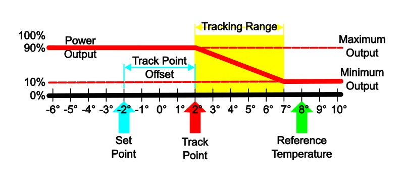
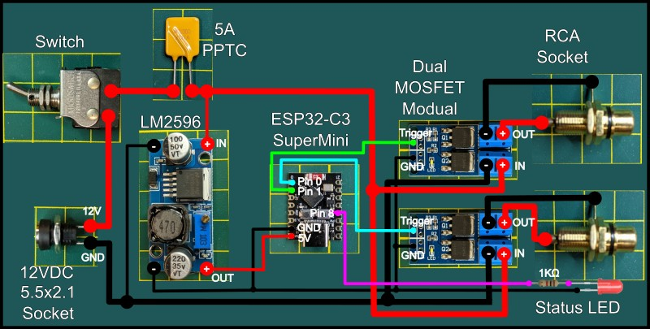
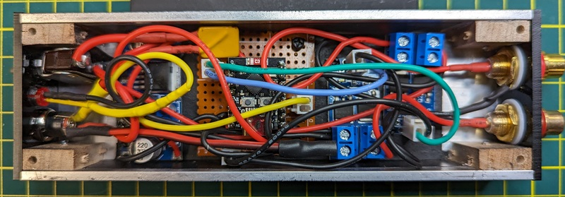
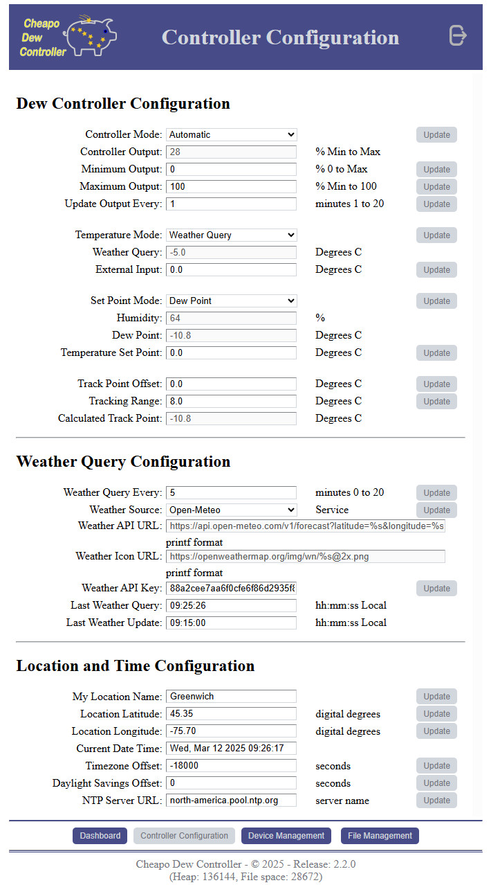

# 

# Introducing CheapoDC

The Cheapo Dew Controller, or CheapoDC, is a low cost, easy to build DIY dew controller based on an ESP32-C3 mini.
Parts required include the ESP32-C3 mini, a MOSFET module for each output, a 12V to 5V buck converter, some protoboard,
 RCA sockets, a 12V barrel socket and wire. Cost of the parts should be less than $20 for a unit that
controls 2 dew heater straps.

A primary goal was to keep the project cheap, simple and easy with:

* minimal low cost off the shelf components
* no coding or Arduino IDE experience necessary with both [WebFlash](https://hcomet.github.io/CheapoDC/CheapoDCFlash.html) and [HTTP OTA Update](https://hcomet.github.io/CheapoDC/CheapoDCWebUpdate.html) support
* Comprehensive [Web UI](#web-ui) for configuration and management
* [INDI](https://www.indilib.org/) and [StellarMate](https://stellarmate.com/) support 'out-of-the-box'

CheapoDC can select from four weather sources to provide the local temperature and humidity. The first two, OpenWeather and Open-Meteo, leverage the ESP32 WiFi
capability to query one of the two open weather service APIs. Either the [OpenWeather](https://openweathermap.org/) API
or the [Open-Meteo](https://open-meteo.com/) API may be used to retrieve ambient temperature, humidity and dew point
for the controller's geographic location. No additional
components, such as temperature or humidity probes, are required with these weather sources. As a third weather source option an External Sources, such as a personal weather station, can push weather information to the CheapoDC via the API. Then as a fourth option an optional Humidity Sensor may be added to the CheapoDC to provide the required weather data and selected as the Internal Source.

The CheapoDC may be set up using a basic configuration with two dew strap outputs or it may be configured with up to
four additional outputs or the optional humidity sensor. Each CheapoDC Output is controlled by a separate MOSFET module tied to one of the ESP32's
GPIO pins. The four additional outputs may be configured to be managed either automatically using the CheapoDC dew
control algorithm, along with the two main dew controller outputs,
or manually via the Web UI or API. Dew control algorithm managed pins and thus dew strap outputs are all tied to the
same ESP32 PWM channel and will have the same output.

CheapoDC hardware build details can be found in the [Hardware](#hardware) section of this document.

CheapoDC firmware may installed on your device using one of the following methods:

* Using the Arduino IDE: Details on how to build the CheapoDC firmware as well as information about the latest
firmware release may be found with the source code in the [CheapoDC/README.md](./CheapoDC#webflash-as-an-option).
* WebFlash: A web based utility that allows for the installation of the latest firmware directly to your ESP32-C3 based device.

CheapoDC also supports web based Over-the-air (OTA) upgrades of the firmware using the CheapoDC Web UI.

# How the Dew Control Algorithm Works

When working in Automated mode, the controller will periodically calculate the power output to the dew straps using the
calculations below. The default output calculation or update period is 1 minute.

## Controller Power Output Calculation

### Variables

* **Set Point** = ***SP***
  * as set using the **Set Point Mode** selection.
* **Reference Temperature** = ***RT***
  * as set using the **Temperature Mode** selection.
* **Track Point** = ***TP***
  * the calculated temperature point where the **Tracking Range** starts. A **Reference Temperature** less than or equal
to the **Track Point** will cause the controller to use **Maximum Output**.
* **Track Point Offset** = ***TPO***
  * a temperature offset applied to the **Set Point** when calculating the **Track Point** relative to the **Set Point**.
The **Track Point Offset** may be set from -5.0&deg;C to 5.0&deg;C. The default is 0.0&deg;C.
* **Tracking Range** = ***TR***
  * the temperature range starting at the **Track Point** where the controller output ramps up from **Minimum Output** at the high end of the range to **Maximum Output** at the low end of the range. The range may be set to values from 4.0&deg;C to 10.0&deg;C. The default is 4.0&deg;C.
* **Power Output** = ***PO***
  * the percentage of power the controller is outputting to the dew straps. It varies from the **Minimum Output** setting to the **Maximum Output** setting.
* **Minimum Output** = ***MinO***
  * the minimum percent power setting for the controller to output when not in the **Off** **Controller Mode**. Defaults to 0%.
* **Maximum Output** = ***MaxO***
  * the maximum percent power setting for the controller to output when at full output. Defaults to 100%.

### Calculations

$`TP = SP + TPO`$

$`IF`$ $`(RT <= TP )`$ $`THEN`$ $`PO= MaxO`$

$`IF`$ $`(RT >= (TP + TR))`$ $`THEN`$ $`PO = MinO`$

$`IF`$ $`(RT <(TP + TR))`$ $`THEN`$ $`PO = MinO + (MaxO - MinO) * ( 1 - ((RT - TP)/TR))`$

### Examples

Example 1 is primarily a reference image to illustrate the variables defined above.

* Power Output curve is shown relative to the Track Point and the Tracking Range. While the Reference Temperature is greater than the high end of the Tracking Range the Power Output is set to Minimum Output. The Power Output ramps up linearly through the Tracking Range from the Minimum Output to the Maximum Output as the Reference Temperature drops.
* This example shows a Reference Temperature, RT = 8°C, which is greater than the upper end of the Tracking Range, causing Power Output to be set to Minimum Output. In this case Minimum Output is set to 10%.
* The upper end of the Tracking Range, at 7°C, is determined from the Set Point (SP = -2°C) plus the Track Point Offset (TPO = 4°C), creating a Tack Point, TP = 2°C, plus the Tracking Range (TR = 5°C).  

   **NOTE:** The Set Point and the Reference Temperature values may vary from one output calculation to the next with each weather update.

Example 2 shows changing the values of the controller configuration variables can affect the Power Output calculation.

* The Set Point, SP = -2°C, and the Reference Temperature, RT = 8°C, the same as in Example 1. However changing the Track Point Offset, now TPO = 2°C, and the Tracking Range, now TR = 10°C, has changed the Power Output as well as flattening the Power Output curve.
* The Maximum Output has been increased, MaxO = 100%, to allow full power output to be reached at 0&deg;C.

## Dew Controller Configuration Settings

The following modes of operation are used by CheapoDC to determine overall controller operation as well as which values to assign to the Set Point and Reference Temperature when calculating output.

### Controller Mode

The Controller Mode selects the overall operating mode of the dew controller.

#### Automatic

* Uses the **Set Point Mode** and **Temperature Mode** settings to calculate the controller output based on the Power Output calculations above. In Automatic mode the Power Output calculation will be run periodically based on the Update Output Every setting. This may be set to a value from 1 to 20 minutes. The default is 1 minute. Automatic mode may be used with or without internet access.

#### Manual

* Controller output is manually controlled by setting the **Dew Controller Output** either through the Web UI or the API. When in Manual mode the the periodic Power Output calculation is suspended. Using Manual control is an option if internet access for OpenWeather API queries is not available.

#### Off

* Controller output is set to Zero.

### Set Point Mode

The Set Point Mode selects what will be used as the SetPoint for calculating Power Output.

#### Dew Point

* Uses the **Dew Point** as the Set Point used for calculating output. This is the default selection.

#### Temperature

* Uses a **Temperature Set Point** value input via the Web UI or API as the Set Point for calculating output. If the CheapoDC is being used without internet access then this mode allows a Set Point to be defined when a the DeW Point cannot be determined through the OpenWeather API.

#### Midpoint

* Uses the midpoint between the current **Temperature Mode** temperature value and the Dew Point value as the Set Point for calculating output. The impact of selecting this mode is to effectively double the Tracking Range and further flatten the ramp of the Power Output curve.

### Temperature Mode

The Temperature Mode selects how the Reference Temperature will be determined for calculating the Power Output.

#### Weather Source

* Uses the Ambient Temperature returned by the selected Weather Source.This is then used as the Reference Temperature for calculating the controller output.

#### External Input

* Use the **External Input** temperature set through the [Web UI](#cheapodc-controller-configuration) or [API](#cheapodc-api) as the reference temperature for calculating the controller output. This may be the preferred mode when using the controller with KStars/Indi. The CheapoDC [Indilib driver](#indi-driver) can use a temperature probe attached to a focuser as the external input.  
 **NOTE:** If no temperature values have been set for External Input then a value of **-127.0°C** will be shown. The Controller, when in Automatic Mode with Temperature Mode set to External Input,  will set output power at the configured minimum output until a value is set via the WebUI or API.

## Hardware

One of the goals with the CheapoDC is for it to be relatively easy to assemble. Although some soldering will be
required the number of connections is minimized by using common modules. This section focuses on what is required
to build a basic two dew strap controller commonly needed for a primary telescope and secondary guide scope.

If you need additional dew controller outputs or the ability remotely control the power to another device then that
information is covered [here](https://hcomet.github.io/CheapoDC/CheapoDCBuild.html).

If you are looking to add the optional SHT30 Humidity sensor to support a complete standalone device, that information is covered [here](https://hcomet.github.io/CheapoDC/CheapoDCSensor.html).

### Component list

* ESP32-C3 SuperMini (Other ESP32 modules should work but this one is very small and low priced) Example: [https://www.aliexpress.com/item/1005005967641936.html?spm=a2g0o.order_list.order_list_main.10.3b2c1802dRy3Tw](https://www.aliexpress.com/item/1005005967641936.html?spm=a2g0o.order_list.order_list_main.10.3b2c1802dRy3Tw)
* Buck converter to reduce 12V to 5V. I used an [LM2596 Module](https://www.amazon.ca/dp/B08Q2YKJ6Q?psc=1&ref=ppx_yo2ov_dt_b_product_details). You could also use an [MP1584EN Module](https://www.amazon.ca/eBoot-MP1584EN-Converter-Adjustable-Module/dp/B01MQGMOKI/ref=pd_sbs_d_sccl_2_3/141-9725081-7037101?pd_rd_w=UMd8F&content-id=amzn1.sym.ca022dba-8a59-468d-95a1-3216f611a75e&pf_rd_p=ca022dba-8a59-468d-95a1-3216f611a75e&pf_rd_r=4WWMQ6QG50JQ2BTYP273&pd_rd_wg=OCFjo&pd_rd_r=381f4abb-88a8-4856-a51f-39d3190099fa&pd_rd_i=B01MQGMOKI&th=1). These modules often have an adjustable output. You'll need to use a Volt meter to adjust the output to 5 volts before hooking it up.
* Two [dual-MOSFET Modules](https://www.amazon.ca/dp/B08ZNDG6RY?psc=1&ref=ppx_yo2ov_dt_b_product_details) to handle output to the dew straps while being able to be triggered by the 3.3V levels from the ESP32 PWM pins.
* A resettable fuse that can handle 5A. An example [5A PPTC](https://www.amazon.ca/10pcs-5000MA-Resettable-RGEF500-GF500/dp/B092T9Q3QR/ref=sr_1_4?crid=3KNZXWN5ZIERR&dib=eyJ2IjoiMSJ9.y5Pp17w_i-KzaprejYOYzM_8u_S5MY_jz1z932C2gBBmx5zcGFKHMHtP6qYXScM_-6ii9W8lDuEq5tbkCUQdYOFESDzjnASBHIusx7zAFOkhc6SNPrOH4O8ExB9WzAI-XgtIUvz-EvjfyOzjX4IN8iGl2GSffYGCb1BvIzldhIbrwCyyvNRyEfUCehiFknfJ5Uz1PSdPnC0BJjzSZp7Frh_EDLOF4CjpyeUQckj0FTQ347ehfh3jy3kHSu3I2iTOEaQZMRdqjpkW_NBOUMMsZsbeRdkMtzq0cIrGcsbUdhk.8jKyynsByh2dYlS0gLu9IdNbxiIm4iDIQv6g0ucFzCc&dib_tag=se&keywords=5a+pptc&qid=1709138849&sprefix=5a+pptc%2Caps%2C80&sr=8-4)
* Optionally an LED and resistor for the status LED. Many astrophotographers do not want power LEDs or lights of any sort on their equipment. If you fall into this category then just use the ESP32 onboard LED as the status LED. If you would prefer a visible status LED on your project case then you may optionally add one. Status LED details may be found in the [Status LED Section](#cheapodc-status-led).  
In my implementation I used a red LED connected to the same pin as the onboard LED, pin 8. I used a 1K resistor to keep the LED fairly dim while still working.
* Some assorted hardware:
  * 12VDC 5.5mm x 2.1mm socket. Common socket size used for Astronomy.
  * Switch that will work for 12VDC at 5A.
  * Two RCA sockets. RCA plugs are commonly used for dew straps.

### Basic Wiring Diagram

The default configuration for the basic dual output controller uses Controller Outputs, 0 and 1, mapped to GPIO pins 0 and 1.
If you cannot use these GPIO pins then they may be changed using the Web UI on the [Device Management](#cheapodc-device-management)
page or the default values may be changed in the [CDCDefines.h](CheapoDC/README.md#configure-firmware-in-the-cdcdefinesh-file) file
before building the firmware.

### Working Implementation

Assembled in a 6 inch long piece of 2"x1" aluminum channel. This also has Pin 8, which is the status LED, connected to an extra LED on the left side for external visibility. The ESP32-C3 is also mounted in some protoboard to make the wiring easier. If you plan to use a small case like this, use silicone hookup wire. The extra flexibility of silicone wire will save a lot of frustration. I used 22 awg wire for the 5V and 3.3V ESP32 connections and 18 awg wire for the 12V connections.

Two completed CheapoDCs from the outside.

## Firmware

How to build the CheapoDC firmware can be found [here](/CheapoDC/README.md). All aspects of the CheapoDC are configurable through the [WebUI](#web-ui) making [WebFlash](https://hcomet.github.io/CheapoDC/CheapoDCFlash.html) the easiest way to install and then configure firmware.

## Weather Source

CheapoDC requires temperature and humidity information to calculate the dew point and then the required controller output power for dew prevention. This information is provided by a Weather Source. CheapoDC can query one of two open weather API services, be provided weather information via the CheapoDC API or use an optional internal humidity sensor. The Weather Source may be set using the [Web UI](#cheapodc-controller-configuration) or through the [API](#cheapodc-api). The following four Weather Sources are available:

### [Open-Meteo](https://open-meteo.com/) (Default)

pen-Meteo, an open API based weather service, is the default Weather Source for CheapoDC. Use of the Open-Meteo API does not require any registration for current weather queries. The free level allows for 10,000 API calls per day. Weather updates seem to be regular at a 15 minute interval. While using a 5 minute query interval, several CheapoDCs can be running at the same time without issue. Requires correct location information and internet access to work.

### [OpenWeather](https://openweathermap.org/)

 OpenWeather, also an API based weather service, requires a registered account and API key. The account is free and allows for up to 60 queries/minute and 1,000,000 per month. Weather updates can occur from 5 to 20 minutes apart. Doing an API call every 5 minutes is more than adequate for dew control and even with 2 or 3 CheapoDC's sharing a key should have no issue at the free account level. Register and get your API key [here](https://home.openweathermap.org/users/sign_up). Requires correct location information and internet access to work.

### External Source

 When the Weather Source is set to External Source the temperature and humidity values for your location must be set via the CheapoDC API. This allows for integration with other weather services or personal weather stations. The [INDI driver](#indi-driver) supports this capability.

 ### Internal Source

 When the Weather Source is set to Internal Source the temperature and humidity values for your location are retrieved from an SHT3x series humidity sensor. The sensor must be connected to the ESP32 C3 and configured on the [Device Management](#cheapodc-device-management) page of the WebUI.

### Which Open Weather Service to use?

Both services require a location using Latitude and Longitude which you can set using the CheapoDC [Web UI](/README.md#web-ui) or [CHeapoDC API](#cheapodc-api). Both sources will use weather stations close to the provided coordinates. OpenWeather provides the name of the weather station used in its response. Open-Meteo does not. If run side-by-side with the same co-ordinates they provide slightly different results. You may want to check which service provides the best results for your location.

As indicated the default service is Open-Meteo. This is primarily because no registration is required to use the open service.

## Web UI

CheapoDC comes with a Web UI that supports basic web authentication. The default is "admin" for both username and password. The password can (and should) be changed on the WebUI [Device Management](#cheapodc-device-management) page. TLS (or HTTPS) is not supported. Security is minimal with the intention to provide a deterrent to someone easily doing an OTA upgrade to the firmware or uploading files to the LittleFS partition.

The Web UI has 4 main pages, a dashboard, a configuration page, a device management page and a file management page.

### CheapoDC Dashboard

  

The Dashboard provides a summary of the current location, weather, controller output and settings. Internet connectivity is required for current weather information and the weather icon.

### CheapoDC Controller Configuration

  

CheapoDC Configuration page is where dew controller parameters may be set. These include the [Controller Mode](#controller-mode), [Temperature Mode](#temperature-mode), [Set Point Mode](#set-point-mode), [Weather Source](#weather-source-1) and [variables](#variables) that affect dew controller output.

The Location and Time Zone may be set here and are required for proper operation when using either Open-Meteo or OpenWeather as a Weather Source.

### CheapoDC Device Management

  

The Device Management page is where device level configuration is done for the CheapoDC. This includes:

#### Controller Output Configuration

Used to configure GPIO Pin mappings for outputs as well as setting the Output Mode for each output. The CheapoDC can support up to 6 Controller Output Pins, Pin 0 through Pin 5. Pins 0 and 1 may only be used as dew controller outputs while Pins 2 through 5 may be set to any of the supported Output Modes:

##### Output Modes

|Output Mode|Description|Supported Output Pins|
|-----------|---------------------|-----------|
|Disabled|Output is disabled. The default. GPIO pin mapping set to -1.|Pin 0 through Pin 5|
|Controller|Output is controlled by the dew controller.|Pin 0 through Pin 5|
|PWM|Output is manually controlled using PWM and output may be set from 0% to 100%.|Pin 2 through Pin 5|
|Boolean|Output is manually controlled and may be either Off (0%) or On (100%).|Pin 2 through Pin 5|

Note that a Controller Output Pin to GPIO Pin mapping must be set before an Output Mode may be selected. These settings may be controlled via the Web UI or the API.

#### WiFi Configuration

Shows current network information and allows you to configure the hostname and WiFi access point to use for network access. CheapoDC can be configured to step through multiple access points to make a WiFi connection.

* Network Information
  * Wifi Mode: STA = Station Mode, AP = Access Point Mode.
  * Hostname: Current active hostname. If updated a reboot is required to see the new hostname.  
  **Note:** Changing the hostname will also change the SSID for the device when in Access Point Mode.
  * IP Address.
* Configure WiFi
  * Name: Allows you to pick an access point for editing the password. Or, select `Add WiFi` to add an access point.
  * SSID: Is the access point SSID point to add or edit. To delete an access point blank out the SSID and click **Update**.
  * Password: Is the password for the access point. **Show Password** will only work for adding a new WiFi access point.

Changes to any of the WiFi Configuration setting require a reboot to take effect.

#### Change Password

Changing the default password of ***admin*** to your own password is recommended.

#### Humidity Sensor Configuration

Used to configure which pins are used for by the SHT3x humidity sensor. The humidity sensor uses the I2C protocol and two GPIO pins are required. One for the I2C SDA (data) line and one for the I2C SCL (clock) line. If using the humidity sensor then its recommend to use pin 10 for SDA GPIO and pin 9 for SCL GPIO. If not using the humidity sensor then leave the two values set to -1. If either setting has a negative value then the firmware will not attempt to intialize I2C and the humidity sensor.

#### Status LED Configuration

Used to change the Status LED pin mapping from the default of GPIO 8. Also used to set the active High Value to ***1*** or ***0***.

#### Firmware Update

CheapoDC supports two methods for updating firmware.

1. Web OTA Update: Will indicate when a new release is available and then allow for an HTTP based OTA update. This will update both the firmware and data partitions while preserving your configuration settings. No software or Arduino IDE knowledge is required for this update method. Please consult the [Web OTA Update FAQ](https://hcomet.github.io/CheapoDC/CheapoDCWebUpdate.html) for details.
2. Manual OTA Update: Allows for an OTA update to firmware that has been compiled and built on your own machine. This only updates the data partition. You will need to manually update the files in the data partition using the [File Management UI](#cheapodc-file-management). At least Arduino IDE knowledge is required for this method.

#### Reboot Device

To remotely reboot the CheapoDC.

### CheapoDC File Management

  

The CheapoDC uses LittleFS for file storage on the ESP32. Although LittleFS supports directories as well as files CheapoDC uses a flat structure and all files are managed at the root. The file management page supports upload, download and delete functions.

## CheapoDC Status LED

The Status LED is used to provide information about the current status of the CheapoDC. Status blinking lasts for 10 seconds. It will blink as WiFi access attempts are made. If a Station mode connection is successfully made to an access point then the status LED will slow blink (1 second cycle). If no connection is made then the CheapoDC will go into Access Point mode. The status LED will then fast blink (200ms cycle).

The status LED will also blink for 10 seconds after the controller changes the power output and after an API or Web UI driven controller configuration change.

If the status LED is not turning off after connecting to WiFI or after the 10 second blink then you may need to reverse the High value setting. This can also be done in the Web UI by changing the High Value setting in [Status LED Configuration](#status-led-configuration).

## CheapoDC API

The CheapoDC provides API access to all configuration and data items available through the [Web UI](/README.md#web-ui). There is no authentication support in the API but the API also does not support firmware OTA updates or file management. These can only be done through the Web UI.

CheapoDC supports two API mechanisms:

1. TCP API using JSON syntax
2. Basic Web API utilizing HTTP POST

The APIs use the same commands which are listed in the top of [CDCommands.cpp](/CheapoDC/CDCommands.cpp). Commands are 2 to 4 character strings. For each command there is a map indicating:

* the number of the command,
* whether or not the value associated with the command is to be saved or loaded using the CDCConfig.json file,
* units used for the value. Units are HTML or JSON formatted and may be:
  * None: empty string.
  * Degrees Celsius: "\&deg;C"
  * Decimal Degrees: "\&deg;"
  * Percent: "\&percnt;"
  * Milliseconds: "msec"
  * Seconds: "sec"
  * Minutes: "min"
  * JSON ENUM, for enumerated values like Controller Mode.
    * ie: "{"Mode":["Automatic","Manual","Off"]}"

The table below provides a list of the commands but the code is the final correct source of truth here.

* String maximum lengths are identified in the table.
* Floats are truncated to 2 decimal places.
* All commands except **QN** and **PWDH** support getter API methods.
* For security reasons, **PWDH** does not allow a getter API but it also restricts the setter to the Web API and HTTP POST method. It also requires that the current Password digest hash be submitted as a second parameter.
* The **QN** command is a setter only command. It requires a value that is not Null. "NA" works.
* Commands supporting a **Setter** method are identified.
* The **ATPQ** and **HU** commands are only setter commands when Weather Source is set to External Source.
* Date and time responses are in local time based on the Time Zone Offset and DST Offset values.
* Controller Output commands: CPP#, CPM# and CPO# are independent API commands where the # must be one of 0, 1, 2, 3, 4 or 5.
* Controller Output command CPP# allows a Controller Output to be mapped to -1 for Disabled or GPIO 0 through 39. Which actual GPIO pin to choose is ESP32 module dependent.
* Using an invalid command or trying a setter on a command not supporting a setter will return an error.
* Strictly speaking command values are always treated as Strings since the values are always enclosed in quotes in the JSON. Conversion to appropriate type is handled internally.
* The **CLC** command has been deprecated.

### CheapoDC Commands

|Command|Setter|Units|Type|Description|
|:------:|:---:|-----|----|-----------|
|   TMFL   |&cross;|  HTML    | String [*] |   File list in HTML for use in Web UI |
|   WICON  |&cross;|  None    | String [4] |   Weather Icon for use with OpenWeather |
|   WDESC  |&cross;|  None    | String [32]|   Weather description |
|   ATPQ   |&check;|  &deg;C    | Float |   Ambient temperature from weather query Settable when Weather Source is set to External Source |
|    HU    |&check;|  &percnt;    | Integer |   Relative humidity (0 to 100) Settable when Weather Source is set to External Source. |
|    DP    |&cross;|  &deg;C    | Float |   Dew point|
|    SP    |&check;|  &deg;C    | Float |   Temperature set point|
|    TPO   |&check;|  &deg;C    | Float |   Track Point offset (-5.0 to 5.0)|
|    TKR   |&check;|  &deg;C    | Float |   Tracking range (4.0 to 10.0)|
|    DCO   |&check;|  &percnt;    | Float |   Dew Controller Output (0 to 100) Settable when Dew Controller Mode set to Manual. |
|    WS    |&check;|  None    | ENUM |   Weather source  Open-Meteo = 0 OpenWeather = 1 External Source = 2 Internal Source = 3|
|    LQT   |&cross;|  None    | String [32] |   Last weather query time|
|    LQD   |&cross;|  None    | String [32] |   Last weather query date|
|    QN    |&check;|  None    | String [4] |   Query weather now (Set only command)|
|    FW    |&cross;|  None    | String [16] |   firmware version|
|    HP    |&cross;|  Bytes    | Integer |   Heap size|
|    LFS   |&cross;|  Bytes    | Integer |   LittleFS remaining space|
|    DCM   |&check;| Enum    | Enum |   Dew controller mode Automatic = 0 Manual = 1 Off = 2|
|   DCTM   |&check;| Enum    | Enum |   Dew controller temperature mode Weather Source = 0 External Input = 1 |
|    SPM   |&check;| Enum    | Enum |   Dew controller set point mode Dew Point = 0 Temperature = 1 Midpoint = 2 |
|    WQE   |&check;|  Minutes    | Integer |   Weather query every|
|    UOE   |&check;|  Minutes    | Integer |   update output every|
|   WAPI   |&cross;|  None    | String [256] |   Weather API URL|
|   WIURL  |&cross;|  None    | String [256] |   Weather Icon URL|
|   WKEY   |&check;|  None    | String [64] |   Weather API Key|
|    LAT   |&check;|  &deg; (Digital)    | Float |   Location latitude (-90.00 to 90.00)|
|    LON   |&check;|  &deg; (Digital)    | Float |   Location longitude (-180.00 to 180.00)|
|    LNM   |&check;|  None    | String [32] |   Location name|
|    TMZ   |&check;|  Seconds    | Integer |   Location time zone (seconds)|
|    DST   |&check;|  Seconds    | Integer |   Location DST offset (seconds)|
|    LED   |&check;|  None    | Integer |   Status LED GPIO pin|
|LEDH|&check;|None|Integer|Status LED High value. 1 or 0.|
|    NTP   |&check;|  None    | String [64] |   NTP serverName|
|   OMIN   |&check;|  &percnt;    | Integer |   DC Min output (0 to Max-1)|
|   OMAX   |&check;|  &percnt;    | Integer |   DC Max output (Min+1 to 100)|
|    CDT   |&cross;|  None    | String [64] |   Current Date Time|
|   ATPX   |&check;|  &deg;C    | Float |   External Temperature input by external app|
|    CTP   |&cross;|  &deg;C    | Float |   Current Track Point Temperature|
|    WUL   |&cross;|  None    | String [32] |   Weather station reported in query|
|  ~~CLC~~ |&cross;|  &percnt;    | ~~Integer~~ |   ***Deprecated***|
|   LWUT   |&cross;| None    | String [32] |   Last weather update time hh:mm:ss|
|   LWUD   |&cross;|  None  | String [32] |   Last weather update date DDD, dd MMM yyyy|
|    UPT   |&cross;|  None    | Integer |   Device uptime hhh:mm:ss:msec|
|   WIFI   |&cross;|  None    | String [4] |   WIFI mode AP (Access Point) or STA (Station Mode)|
|    IP    |&cross;|  None    | String [16] |   IP Address|
|    HN    |&cross;|  None | String [16] |   Host name |
|    WQEN    |&check;|  None | Bool | Web Query Enabled False = 0 True = 1|
|   CPP#   |&check;|  None    | Integer |Controller Output (0 to 5) to GPIO pin mapping -1 to 39 -1 = Disabled|
|    CPM#    |&check;|  None    | ENUM |Controller Output (2 to 5) Mode  Disabled = 0 Controller = 1 PWM = 2 Boolean = 3|
|CPO#|&check;|&percnt;|Integer|Controller Power Output (0 to 5), mode dependent: Set - PWM, Boolean Get - all modes|
|  SDAP  |&check;| None | Integer | Humidity sensor SDA GPIO mapping -1 to 39 -1 = Disabled|
|  SCLP  |&check;| None | Integer | Humidity sensor SCL GPIO mapping -1 to 39 -1 = Disabled|
|PWDH|&check;|None|String[32]|Change the [Digest access authentication](https://en.wikipedia.org/wiki/Digest_access_authentication#:~:text=In%20contrast%2C%20basic%20access%20authentication,It%20uses%20the%20HTTP%20protocol.) MD5 Password Hash. |
|FWUP|&cross;|None|String[16]|Returns new FW release availability: x.y.z = update available NOFWUPDATE = no update NOSUPPORT = Web Update not supported|

### TCP API

The TCP API uses JSON formatted commands over TCP on port 58000. JSON strings must always be terminated with a newline character "\n". "cmd" in the following formats is the 2 to 4 character command identified in [CDCommands.cpp](/CheapoDC/CDCommands.cpp).

#### Setter format

* Send: **{"SET":{"cmd":"value"}}**
* Response: **{"RESULT": result}**  

#### Getter format

* Send: **{\"GET\":"cmd"}**
* Response: **{"cmd":"value"}** - *if successful*
* Response: **{"RESULT": result}** - *if failure*

***NOTE:*** Where a response of **{"RESULT": result}** is received ***result*** may be one of:  

|   result  |  Reason                                            |
|:---:|----------------------------------------------|  
|0|for success |
|-1|for a command execution error|
|-2| for an unknown command or API parsing error|

### Web API

The Web API uses POST and "x-www-form-urlencoded" with name value pairs.

#### Setter Format

* Send: **cmd=value**  
* Response: HTTP status code of 200 on success.

#### Getter Format

* Send: **get=cmd**  
* Response: **cmd=value**  
success has HTTP status code of 200.

## Configuration Files

See the Configuration Files section in [Building and Installing CheapoDC](./CheapoDC/README.md/#configuration-files).

## [INDI Driver](https://www.indilib.org/aux/cheapodc-dew-controller.html)

An INDI driver is now available in the master branch as of INDI release 2.0.7, April 1, 2024. Details should become available on the [INDI website devices list](https://www.indilib.org/aux/cheapodc-dew-controller.html) as well as the [StellarMate website devices list](https://www.stellarmate.com/devices.html).

Driver version 1.2 supports the latest versions of the CheapoDC firmware adding support for the four Additional Controller Outputs. Up to date driver documentation is maintained [here](https://hcomet.github.io/CheapoDC/indi/CheapoDC.html).

# Third Party Acknowledgements

* Two libraries are bundled into CheapoDC:
  * esp32FOTA from Chris Joyce provides the [Web OTA Update](https://hcomet.github.io/CheapoDC/CheapoDCWebUpdate.html) capability for HTTP OTA updates. The original library may be
  found at [https://github.com/chrisjoyce911/esp32FOTA](https://github.com/chrisjoyce911/esp32FOTA). esp32FOTA also bundles in a semantic version parsing library, [semver](https://github.com/h2non/semver.c), from h2non.
  * EasyLogger from Alex Skov Jensen provides the debug logging macros. The original library may be
  found at [https://github.com/x821938/EasyLogger](https://github.com/x821938/EasyLogger).
* Other libraries used by CheapoDC include:
  * [ArduinoJson by Benoit Blanchon](https://arduinojson.org/)
  * [ESP Async WebServer by ESP32Async](https://github.com/ESP32Async/ESPAsyncWebServer)
  * [Async TCP by ESP32Async](https://github.com/ESP32Async/AsyncTCP)
  * [Sensirion I²C SHT3X by Sensirion](https://github.com/Sensirion/arduino-i2c-sht3x)
  * [Sensirion Core by Sensirion](https://github.com/Sensirion/arduino-core/)
  * [Time by Michael Margolis](https://playground.arduino.cc/Code/Time/)
* The [WebFlash](https://hcomet.github.io/CheapoDC/CheapoDCFlash.html) capability uses [ESP Web Tools](https://esphome.github.io/esp-web-tools/) from [Home Assistant](https://www.home-assistant.io/).
